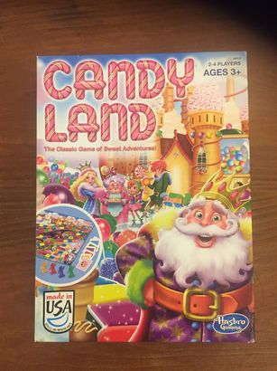

*IDEA 135: Games at Work*
# Sketch 2:  Game Modification

**Rewrite the rules of the board game "Candy Land."**

<https://idea135.github.io/game-mod/>

Devise new rules for a Candy Land game. You may decide to make only minor tweaks to the original Candy Land rules. You may “mashup” Candy Land with another game’s rules (e.g. poker, Monopoly). Or, you may "start fresh," treating the 
game box contents as building blocks for an entirely new game.  Publish your modified Candy Land instructions as an HTML project on github. The rules should be easy for adults to read and understand. Your instructions page can include 
text, graphics, and hypertext links.  Once you’ve published your HTML page, ask 2 to 4 friends or classmates to test out your game. Get them to read your rules before they play. If your friends have questions about a rule, you should amend the language of your rules to eliminate potential confusion. 
Take note of the way your friends interact with one another while they play the game. If necessary, amend your rules to improve your game in response to the "focus group" feedback.

## Rules

1. You are limited to using the objects found in a Candy Land board game set (game board, cards, plastic player figurines). You may not physically alter the board or game pieces. You may *not* add additional physical elements (timers, dice, etc). 
2. Your game should be playable (start to finish) in under 10 minutes.
3. Give your game a new name and specify its recommended age level (e.g. 3+, 10+, 18+, 40+, 9-99, etc.)

## Learning Objectives
- Learn to clearly articulate game rules in writing 
- Consider how rule variations impact game play
- Use HTML to build a web page
- Think outside of the box while remaining inside the box

## Notes
If you’re stumped about where to start, try playing "Candy Land" after changing one significant word in the the "Object" or "Gameplay” sections of the official rules. 
Or, you can look up the rules of a card game (e.g. poker, blackjack) or another board game (e.g. Chess, Go, Monopoly) and imagine how the rules of that game might be applied to the contents of the Candy Land box. Or, just mess around: use box contents for unstructured free play.

- Candy Land board and game pieces are available in the game play room (Avery 337). You may borrow  a board, but please leave at least one complete set in the game room at all times.

## Additional Resources
- [Official Candy Land Rules](http://www.hasbro.com/common/instruct/Candy_Land__(2004).pdf)
- [Mathematical analysis of Candyland](http://datagenetics.com/blog/december12011/index.html)

